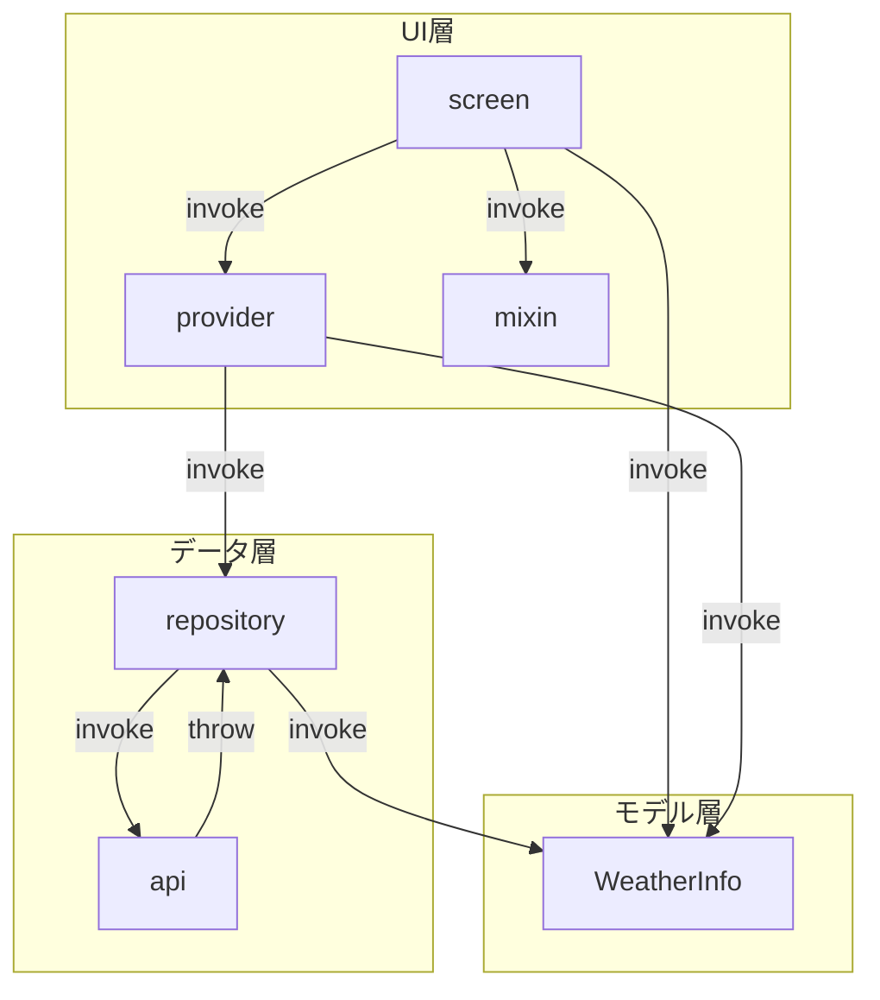
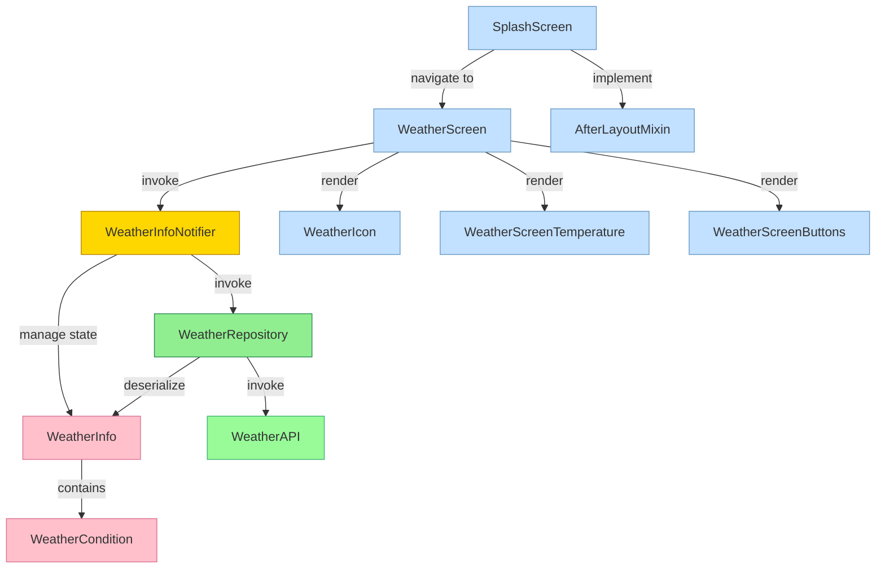

# Architecture

## 基本方針
- 層状アーキテクチャ（レイヤードアーキテクチャ）とする
- UIとUI以外の実装を明確に分離する
- UI以外の構造はできるだけ分類するが、極度に（ドメイン）ロジック的な実装がない限りUIから直接repositoryを参照する形とする

## ディレクトリ構造

```
lib/
├── data/
│   ├── api/             外部への接続（API）
│   └── repository/      外部への接続を抽象化し、上位層に機能を提供する
├── model/               内部で利用する構造体など
├── UI/
│   ├── provider/        UI(screen)へのプロバイダー
│   └── screen/          画面実装
│       └── mixin/       画面へ提供するMixIn
└── main.dart
```

## 依存関係

### 依存の方向

下記のような依存関係を目指している（が、実現できていない）

```
UI層 → モデル層 ← データ層
```

現状現状を図でまとめる

**クラス図**




**コンポーネント図**

